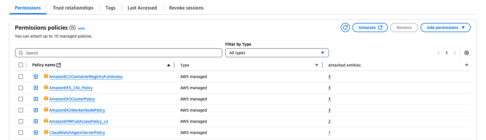

# Set up Coworking Space Service Project

## Follow steps below to set up the project

```bash
eksctl create cluster --name my-cluster --region us-east-1 --nodegroup-name my-nodes --node-type t3.small --nodes 1 --nodes-min 1 --nodes-max 2
```
### Step 1. set up an EKS cluster by command

```bash
aws eks --region us-east-1 update-kubeconfig --name my-cluster
kubectl config current-context
```
### Step 2. Set up K8s in local environment

```bash
kubectl apply -f deployment/coworking-configmap.yaml
kubectl apply -f deployment/coworking-secrets.yaml
```
### Step 3. Configure ENV variable and Secrets

----
## Setup Database using postgresql
### Step 1. Apply Service and Deployment to EKS and Create database in EKS. (include seed data to database)
#### Step 4.1. deploy
```bash
kubectl apply -f deployment/postgresql-deployment.yaml
kubectl apply -f deployment/postgresql-service.yaml
kubectl apply -f deployment/pv.yaml
kubectl apply -f deployment/pvc.yaml
```

#### Step 4.2. public Ip and connect to database, and run sql file to create tables and seed data
```bash
kubectl port-forward --address 127.0.0.1 service/postgresql-service 5433:5432 &
export DB_USER=`kubectl get configMap coworking-config -o jsonpath='{.data.DB_USER}'`
export DB_NAME=`kubectl get configMap coworking-config -o jsonpath='{.data.DB_NAME}'`
export DB_PASSWORD=`kubectl get secret dbpassword-secret -o jsonpath='{.data.DB_PASSWORD}' | base64 --decode`
PGPASSWORD="$DB_PASSWORD" psql --host 127.0.0.1 -U ${DB_USER} -d ${DB_NAME} -p 5433 < ./db/2_seed_users.sql
PGPASSWORD="$DB_PASSWORD" psql --host 127.0.0.1 -U ${DB_USER} -d ${DB_NAME} -p 5433 < ./db/3_seed_tokens.sql
PGPASSWORD="$DB_PASSWORD" psql --host 127.0.0.1 -U ${DB_USER} -d ${DB_NAME} -p 5433 < ./db/1_create_tables.sql
```
-------
## Deploy Coworking Service to EKS Cluster
```bash
kubectl apply -f deployment/coworking-app.yaml
```
### Check the service is working correctly

```bash
kubectl get pods  
#NAME                          READY   STATUS    RESTARTS   AGE
#coworking-8cc779bfd-678gm     1/1     Running   0          47m
#postgresql-77d75d45d5-wn2nk   1/1     Running   0          119m

kubectl get svc 
#NAME                 TYPE           CLUSTER-IP      EXTERNAL-IP                                                              PORT(S)          AGE
#coworking            LoadBalancer   10.100.211.79   a1b424daa00ea43bc9e09ccdaa181584-644528242.us-east-1.elb.amazonaws.com   5153:31071/TCP   30m
#kubernetes           ClusterIP      10.100.0.1      <none>                                                                   443/TCP          122m
#postgresql-service   ClusterIP      10.100.1.227    <none>                                                                   5432/TCP         95m

// Make request to API: /api/reports/user_visits to test the service
curl http://a1b424daa00ea43bc9e09ccdaa181584-644528242.us-east-1.elb.amazonaws.com:5153/api/reports/user_visits
```
---
## Setup CloudWatch Agent
Attach the CloudWatchAgentServerPolicy
```bash
aws eks create-addon --addon-name amazon-cloudwatch-observability --cluster-name my-cluster
```
### Notes:
- Make sure your Role enough permissions like below
